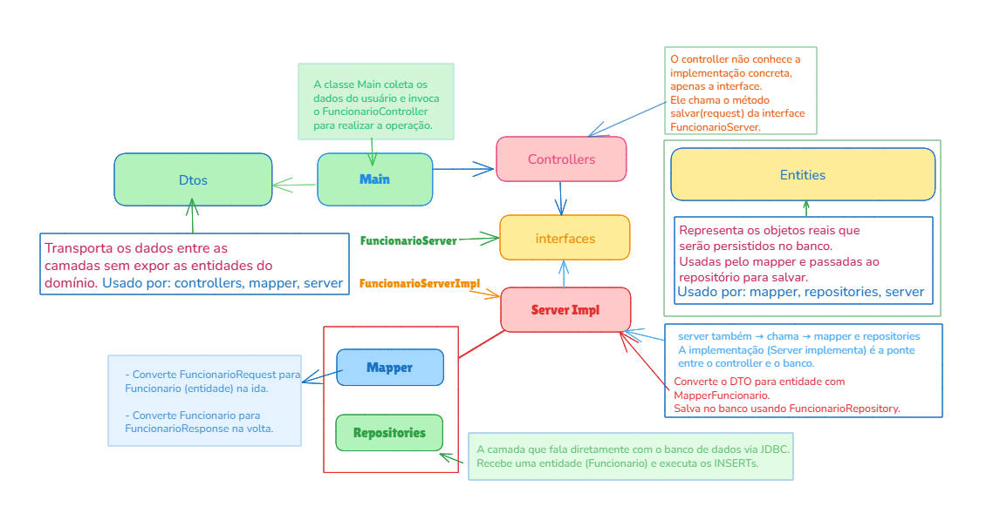

---

## 💡 Boas práticas aplicadas

- Separação de responsabilidades (SRP)
- Inversão de dependência com interfaces
- Mapeamento DTO ↔ Entidade
- Camadas desacopladas (Controller → Service → Repository)
- Uso de `UUID` para identificadores únicos

---

## 🔁 Resumo do fluxo de dependência (injeção manual):

✅ A Main é o ponto de entrada.

✅ A Main instancia as dependências (mapper, repository, service, controller).

✅ A Main chama o controller.

✅ E o controller chama o método da interface, que é executado pela implementação.

Resumo do fluxo de dependência:

var service = new FuncionarioImpl(mapper, repository); // <--- Aqui criamos a service
var controller = new FuncionarioController(service);    // <--- Injetamos no controller

📦 FuncionarioController.java

public class FuncionarioController {

	private final FuncionarioServer funcionarioService;

	// 👇 Aqui a service é "injetada" via construtor
	public FuncionarioController(FuncionarioServer funcionarioService) {
		this.funcionarioService = funcionarioService;
	}

	public FuncionarioResponse cadastrarFuncionario(FuncionarioRequest request) {
		// 👇 Aqui usamos o método da interface
		return funcionarioService.salvar(request);
	}
}

## ✅ Conclusão:

A service (FuncionarioImpl) vai pro controller via construtor.

Isso se chama injeção de dependência por construtor, uma prática comum e recomendada.

A interface atua como contrato, permitindo que o controller funcione sem acoplamento direto à implementação concreta.


## Atualização — Persistência JDBC + Transação (11/08/2025 00:30)

**O que foi implementado**
- Fluxo de persistência com **JDBC puro** usando `ConnectionFactory`.
- `FuncionarioImpl` passa a **controlar a transação** (`setAutoCommit(false)`, `commit`/`rollback`).
- Repositórios **stateless** recebem a mesma `Connection` e **não a fecham**.

**Motivação**
Garantir **atomicidade** e **consistência referencial** ao salvar funcionário + endereço, evitando registros órfãos e erros de FK.

**Como testar rapidamente**
1. Execute a aplicação (método `main` ou endpoint de criação).
2. Verifique no banco:
   ```sql
   SELECT * FROM endereco;
   SELECT * FROM funcionario;

Do jeito que está eles estão acoplados em dois pontos.

Service → JDBC (Connection)
O FuncionarioImpl passa java.sql.Connection para os repositórios. Isso vaza infraestrutura para o caso de uso. É acoplamento desnecessário ao JDBC.

Service → implementação concreta de repositório
Se você injeta new FuncionarioRepository() (classe concreta), o service fica acoplado à implementação, não ao contrato.

## 🛠️ Tecnologias Utilizadas

Java 17+	Linguagem principal utilizada no desenvolvimento da aplicação.
JDBC        (Java Database Connectivity) API para conexão e execução de comandos SQL com o banco de dados.
MySQL	    Sistema de gerenciamento de banco de dados relacional usado na persistência.
Docker	    Utilizado para subir o container do banco de dados MySQL local.
UUID	    Geração de identificadores únicos para entidades (java.util.UUID).
Arquitetura em Camadas	Separação entre apresentação, domínio, serviço e persistência.
DTO Pattern	Transporte de dados entre as camadas sem expor diretamente as entidades.