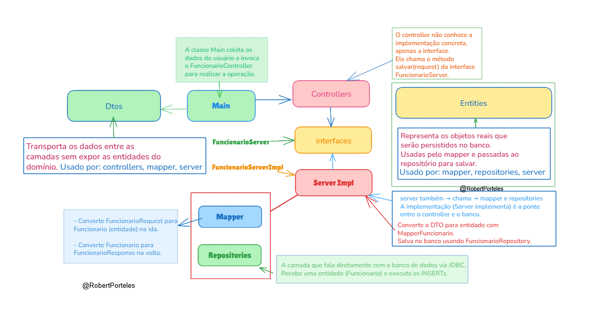

---

### 📌 Resumo

As entidades são o **coração do domínio**, então os outros pacotes precisam acessá-las para:

* **Manipular dados de forma estruturada** (`server`)
* **Persistir no banco** (`repositories`)
* **Transformar dados de entrada/saída** (`mapper`)

Esse uso é natural e **coerente com a arquitetura limpa** e com o padrão de **camadas separadas**.

## 💡 Boas práticas aplicadas

- Separação de responsabilidades (SRP)
- Inversão de dependência com interfaces
- Mapeamento DTO ↔ Entidade
- Camadas desacopladas (Controller → Service → Repository)
- Uso de `UUID` para identificadores únicos

🛠️ Tecnologias Utilizadas

Java 17+	Linguagem principal utilizada no desenvolvimento da aplicação.
JDBC        (Java Database Connectivity) API para conexão e execução de comandos SQL com o banco de dados.
MySQL	    Sistema de gerenciamento de banco de dados relacional usado na persistência.
Docker	    Utilizado para subir o container do banco de dados MySQL local.
UUID	    Geração de identificadores únicos para entidades (java.util.UUID).
Arquitetura em Camadas	Separação entre apresentação, domínio, serviço e persistência.
DTO Pattern	Transporte de dados entre as camadas sem expor diretamente as entidades.